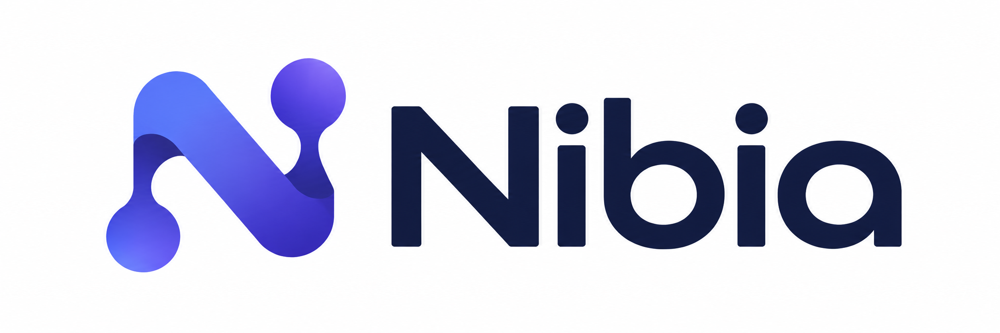

# NIBIA Fabric — Turn everyday computers into a shared AI compute cluster.

**Open-source distributed LLM inference across Mac, Windows, and Linux using aggregate CPU and system memory (RAM).**

<p align="center">
  
</p>

**NIBIA Fabric** is the open-source distributed compute core of **NIBIA**. This Experimental Alpha is a CPU-first local AI compute fabric that coordinates computers on the same trusted LAN and partitions GGUF model execution across the fabric, allowing larger models to use the aggregate CPU and RAM capacity of multiple nodes instead of depending on a single machine.

> **Small models stay local. Larger models can expand across the fabric when they need more memory.**

Release: **v0.7.0 Experimental Alpha**  
CLI version: **v0.7.0-alpha**  
Wire protocol: **2**  
License: **Apache-2.0**

## Download

NIBIA Fabric v0.7.0 Experimental Alpha is available as prebuilt binaries.
Choose the archive for your operating system:

| Platform | Download |
| --- | --- |
| **macOS Apple Silicon** | [Download macOS arm64](https://github.com/nibia-ai/fabric/releases/download/v0.7.0-alpha/nibia-v0.7.0-alpha-macos-arm64.zip) |
| **Linux x86-64** | [Download Linux amd64](https://github.com/nibia-ai/fabric/releases/download/v0.7.0-alpha/nibia-v0.7.0-alpha-linux-amd64.zip) |
| **Windows x64** | [Download Windows amd64](https://github.com/nibia-ai/fabric/releases/download/v0.7.0-alpha/nibia-v0.7.0-alpha-windows-amd64.zip) |
| **SHA-256 checksums** | [Download checksum file](https://github.com/nibia-ai/fabric/releases/download/v0.7.0-alpha/NIBIA_v0.7.0-alpha_SHA256SUMS.txt) |

**Verify the SHA-256 checksum before installation.**

> GitHub also generates automatic **Source code (zip)** and **Source code (tar.gz)**
> archives for every release. These are source snapshots, not the prebuilt NIBIA
> packages intended for normal installation. Use the platform downloads above.

After downloading, follow the [Quickstart](QUICKSTART.md) to install NIBIA,
configure the Primary Node, and pair additional Worker Nodes.

See the complete [v0.7.0 Experimental Alpha release](https://github.com/nibia-ai/fabric/releases/tag/v0.7.0-alpha).

## Supported release platforms

Prebuilt binaries for this Experimental Alpha are provided for:

- **macOS arm64** — Apple Silicon
- **Linux amd64** — x86-64
- **Windows amd64** — x64

Any supported desktop platform can be the **Primary Node**. Primary is a Fabric role, not an OS-specific tier: it is the node running the Controller, Coordinator, Agent, CLI, and local compute for that Simple Mode session.

**32-bit operating systems and CPU architectures are not supported.**

## Why NIBIA Fabric

Modern local AI is often limited by the memory and compute available on one computer. NIBIA Fabric uses hardware you already have around you and turns it into one coordinated inference fabric.

- **Expand model capacity beyond one machine.** Use safe RAM capacity from multiple computers for models that do not fit comfortably on the Primary alone.
- **Use heterogeneous everyday hardware.** Mix supported Mac, Windows, and Linux nodes on the same fabric.
- **Activate only what is needed.** Minimum Safe Fabric selects the smallest fresh worker subset that can satisfy the safe execution plan.
- **Keep the serving surface local by default.** The Web UI and OpenAI-compatible API bind to localhost on the Primary in this alpha.
- **Avoid heavy end-user toolchains.** Prebuilt NIBIA binaries manage a pinned, verified, precompiled llama.cpp runtime.

## How it works

In the default **Simple Mode**, one supported computer is chosen as the Primary Node and runs the Controller, Coordinator, Agent, CLI, and local compute. Additional computers run persistent NIBIA Agents. macOS, Linux, and Windows are peers at the role level; the reference lab often uses a Mac as Primary, but the architecture does not require it. Remote llama.cpp RPC workers and secure relays are activated only when a workload needs them.

```text
                         trusted LAN

     Primary Node                         Worker Nodes
┌──────────────────────────┐        ┌──────────────────────┐
│ Controller + Coordinator │◄──────►│ NIBIA Agent          │
│ Agent + CLI              │  mTLS  │ on-demand RPC worker │
│ local CPU / Metal + RAM  │        │ CPU + RAM            │
│ GGUF model file          │        └──────────────────────┘
│ localhost API / Web UI   │        ┌──────────────────────┐
└──────────────────────────┘◄──────►│ NIBIA Agent          │
                                    │ on-demand RPC worker │
                                    │ CPU + RAM            │
                                    └──────────────────────┘
```

Workers do **not** need their own copy of the GGUF. NIBIA Fabric does not create a physical shared-memory address space; it makes independent node memory useful through distributed runtime placement and model partitioning.

## Run once or serve persistently

NIBIA exposes two primary inference lifecycles:

- **`nibia run`** — load the model, execute one prompt (or an explicitly requested terminal session), print the response, clean up the workload, and exit. Use it for terminal inference, scripts, and benchmarks.
- **`nibia serve`** — load the model once and keep it resident for the built-in Web UI and local OpenAI-compatible API until `Ctrl+C`. Use it for interactive use and repeated requests.

Example persistent server:

```bash
nibia serve \
  --model ~/Models/model.gguf \
  --ctx 4096 \
  --port 8081 \
  --controller http://127.0.0.1:8080
```

The context value is explicit because supported/useful context varies by model and workload. `--port` and `--controller` remain configurable; SERVE itself stays loopback-only by default in this Experimental Alpha.

## What works today

- Persistent NIBIA Agents with on-demand llama.cpp RPC workers.
- Minimum Safe Fabric / Lazy Worker Activation with adaptive per-node memory reserve.
- CPU execution on Linux/Windows and Apple Silicon Metal execution on macOS, with remote capacity expansion.
- TLS 1.3 mTLS Agent control traffic and authenticated reverse RPC relay after pairing.
- Raw llama.cpp RPC kept loopback-only on workers.
- Pinned, SHA-256-verified managed llama.cpp runtime (`b10902`, commit `df03399`).
- Persistent worker-local RPC tensor cache.
- Local built-in llama.cpp Web UI and OpenAI-compatible API.
- Bounded SERVE recovery after temporary selected-Agent loss.
- Workload-scoped Power Guard on macOS, Linux, and Windows.

## Get started

The release is **prebuilt-first**. Normal users do not need Go, Python, CMake, Visual Studio Build Tools, Homebrew, or a local llama.cpp source build.

The [Quickstart](QUICKSTART.md) walks through the complete first-run path:

1. download and verify the release archive;
2. install NIBIA on each node;
3. create the Primary and pair Worker Nodes;
4. validate the fabric;
5. download a GGUF model to the Primary;
6. serve the model and open the built-in Web UI or local API.

**Start here: [QUICKSTART.md](QUICKSTART.md)**

## Validated release coverage

Physical validation for this Experimental Alpha includes:

- **Qwen3 4B Q4_K_M**
- **Qwen3 14B Q6_K**
- **Qwen3 30B-A3B Q4_K_M** — primary exhaustive release-validation workload
- **GPT-OSS 20B MXFP4**
- **Gemma 3 27B IT Q4_K_M**

The release also includes measured Wi-Fi vs Gigabit Ethernet testing, three-node wired execution, tensor-cache reuse testing, multiple context-size tests, lifecycle/recovery testing, and optional-client validation.

See [RELEASE_NOTES.md](RELEASE_NOTES.md) for the validation matrix and [docs/BENCHMARKING.md](docs/BENCHMARKING.md) for measured methodology and results. Measurements are reference data, not guaranteed performance.

## Built-in UI and validated external clients

The default interactive interface is the **llama.cpp Web UI** served locally by NIBIA Fabric. NIBIA Fabric also exposes a local OpenAI-compatible API.

Optional external clients physically validated in documented release test modes include:

- **[Open WebUI](https://github.com/open-webui/open-webui)**
- **[OpenClaw](https://github.com/openclaw/openclaw)**

They are independent projects and are not required NIBIA Fabric dependencies. See [RELEASE_NOTES.md](RELEASE_NOTES.md) for the tested modes.

## Security defaults

NIBIA Fabric v0.7.0-alpha is intended for a **trusted local network**.

- SERVE binds to localhost by default.
- Controller administrative operations are localhost-only.
- Initial pairing uses a short-lived trusted-LAN bootstrap code.
- After pairing, Agents authenticate to the Controller with TLS 1.3 mTLS.
- Raw llama.cpp RPC is not exposed directly on the LAN.
- Managed llama.cpp downloads are pinned and SHA-256 verified before execution.

See [docs/SECURITY.md](docs/SECURITY.md) and [SECURITY.md](SECURITY.md).

## Runtime and ecosystem

NIBIA Fabric uses or interoperates with independent upstream projects that retain their own licenses and project identities:

- **[llama.cpp](https://github.com/ggml-org/llama.cpp)** — MIT-licensed upstream project; pinned managed inference runtime, Web UI/server, GGUF execution, and RPC backend used by this release.
- **[Open WebUI](https://github.com/open-webui/open-webui)** — separately licensed optional external UI; not bundled with NIBIA Fabric.
- **[OpenClaw](https://github.com/openclaw/openclaw)** — MIT-licensed optional external client/agent integration; not bundled with NIBIA Fabric.

NIBIA Fabric itself is licensed under **Apache-2.0**. Third-party projects retain their own upstream license terms. See [NOTICE](NOTICE) and [docs/DEPENDENCIES.md](docs/DEPENDENCIES.md).

## Documentation

| Document | Purpose |
| --- | --- |
| [QUICKSTART.md](QUICKSTART.md) | Install, pair nodes, download a model, and serve it |
| [docs/CLI.md](docs/CLI.md) | Complete CLI and daemon command reference for this release |
| [RELEASE_NOTES.md](RELEASE_NOTES.md) | Validated models, contexts, clients, limitations, and release evidence |
| [docs/BENCHMARKING.md](docs/BENCHMARKING.md) | Reproducible methodology and measured reference results |
| [docs/ARCHITECTURE.md](docs/ARCHITECTURE.md) | Fabric architecture and runtime boundaries |
| [docs/SECURITY.md](docs/SECURITY.md) | Security model and current trust assumptions |
| [docs/TROUBLESHOOTING.md](docs/TROUBLESHOOTING.md) | Common operational issues |
| [docs/DEPENDENCIES.md](docs/DEPENDENCIES.md) | Runtime and third-party dependency boundaries |
| [docs/ROADMAP.md](docs/ROADMAP.md) | Current project direction |
| [CONTRIBUTING.md](CONTRIBUTING.md) | Contribution workflow and DCO |
| [GOVERNANCE.md](GOVERNANCE.md) | Current project stewardship |

## Experimental status

This is an **Experimental Alpha**. CLI details, APIs, state formats, scheduling behavior, and compatibility may change. The current release is CPU-first. GPU pooling, Android nodes, LoRA/QLoRA training, NIBIA Hub/cloud, custom UI, and explicit unsafe/max-capacity modes are outside this alpha release.

NIBIA Fabric is licensed under the [Apache License 2.0](LICENSE).
